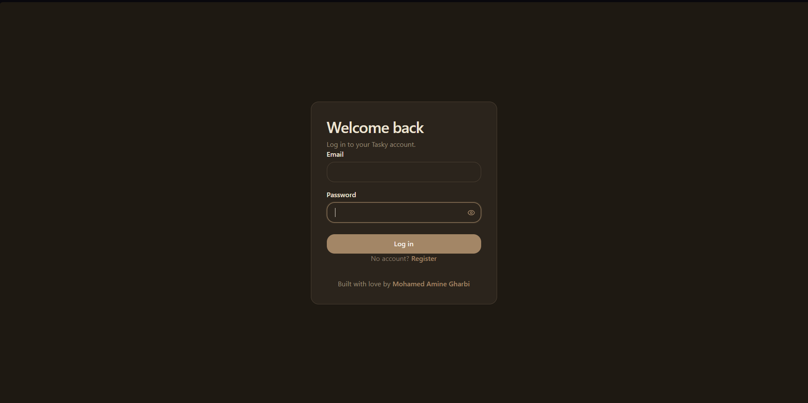
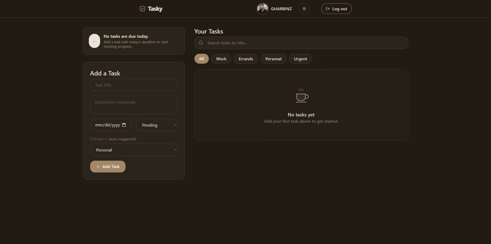
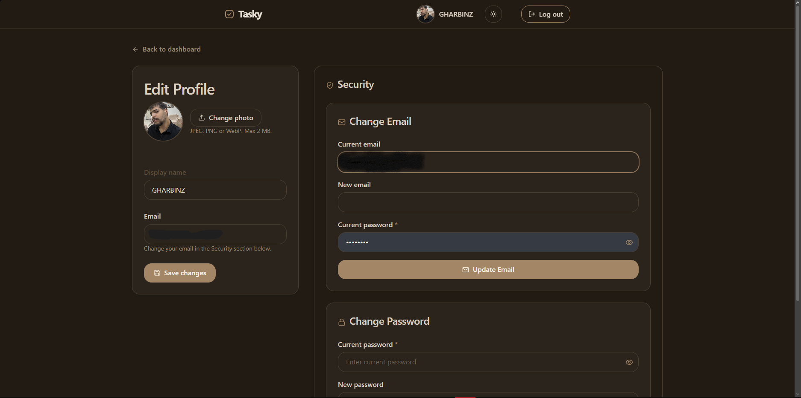

# Tasky - MERN Task Management App

Tasky is a modern, responsive, and secure task management application built with the MERN stack (MongoDB, Express.js, React, Node.js). It provides users with a clean interface to manage their daily tasks, profile, and account security.

## 🚀 Features
- **Authentication:** Secure Register and Login system with JWT.
- **Task Management:** Create, Read, Update, and Delete (CRUD) tasks.
- **User Profile:** Update display name and profile image.
- **Security:** Ability to update email and password with current password verification.
- **Responsive UI:** Built with Tailwind CSS for a seamless experience on all devices.

## 📸 Screenshots

| Feature | Screenshot |
| :--- | :--- |
| **Sign In** |  |
| **Dashboard / Tasks** |  |
| **Profile & Settings** |  |

---

## 🛠 Tech Stack
- **Frontend:** React.js, Tailwind CSS, Axios.
- **Backend:** Node.js, Express.js.
- **Database:** MongoDB.
- **Authentication:** JWT (JSON Web Tokens).

## 👨‍💻 Author
**Developed with love by Mohamed Amine Gharbi.**

---
*Built with passion for clean code and user experience.*
